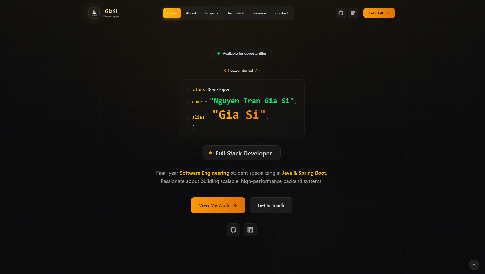

<div align="center">

<!-- Logo & Title -->


# 🚀 GiaSi Developer Portfolio

<h3>
  <em>A Modern, Interactive & Performance-Optimized Personal Portfolio</em>
</h3>

<!-- Badges -->
<p>
  <a href="https://react.dev/"></a>
  <a href="https://vitejs.dev/"></a>
  <a href="https://tailwindcss.com/"></a>
  <a href="https://www.framer.com/motion/"></a>
</p>

<p>
  
  
  
  
</p>

<!-- Quick Links -->
<p>
  <a href="https://nguyentrangiasi.id.vn"><strong>🌐 Live Demo</strong></a>
  &nbsp;•&nbsp;
  <a href="#-features"><strong>✨ Features</strong></a>
  &nbsp;•&nbsp;
  <a href="#-tech-stack"><strong>🛠️ Tech Stack</strong></a>
  &nbsp;•&nbsp;
  <a href="#-getting-started"><strong>🚀 Get Started</strong></a>
</p>

<!-- Preview Image -->
<br />


</div>

<br />

---

## 📋 Table of Contents

- [Overview](#-overview)
- [Features](#-features)
- [Tech Stack](#-tech-stack)
- [Screenshots](#-screenshots)
- [Project Structure](#-project-structure)
- [Getting Started](#-getting-started)
- [Available Scripts](#-available-scripts)
- [Deployment](#-deployment)
- [Contributing](#-contributing)
- [License](#-license)
- [Contact](#-contact)

---

## 🎯 Overview

Welcome to my **Personal Developer Portfolio** — a meticulously crafted website that showcases my journey, skills, and projects as a **Full Stack Developer**. This portfolio is more than just a resume; it's an interactive experience built with cutting-edge web technologies.

<table>
  <tr>
    <td>⚡</td>
    <td><strong>Lightning Fast</strong></td>
    <td>Powered by Vite 6 with optimized bundle splitting and lazy loading</td>
  </tr>
  <tr>
    <td>📱</td>
    <td><strong>Fully Responsive</strong></td>
    <td>Pixel-perfect design from mobile devices to ultra-wide screens</td>
  </tr>
  <tr>
    <td>🎨</td>
    <td><strong>Stunning Animations</strong></td>
    <td>Smooth transitions with Framer Motion & GSAP</td>
  </tr>
  <tr>
    <td>🌙</td>
    <td><strong>Dark/Light Mode</strong></td>
    <td>System-aware theme with seamless switching</td>
  </tr>
  <tr>
    <td>♿</td>
    <td><strong>Accessible</strong></td>
    <td>WCAG compliant with keyboard navigation support</td>
  </tr>
</table>

---

## ✨ Features

<div align="center">

### 🎨 **Design & User Experience**

</div>

| Feature | Description |
|---------|-------------|
| 🌌 **3D Particle System** | Interactive particle backgrounds that respond to mouse movements |
| 🔷 **Geometric Animations** | CSS-powered floating shapes with smooth parallax effects |
| 🖱️ **Custom Cursor** | Unique cursor that transforms on hover states |
| 🎭 **Page Transitions** | Cinematic transitions between routes using Framer Motion |
| 🌓 **Theme Switching** | Smooth dark/light mode with persistent localStorage |
| ✨ **Micro-interactions** | Delightful hover effects and button animations |

<div align="center">

### ⚙️ **Functional Components**

</div>

| Component | Description |
|-----------|-------------|
| 📄 **PDF Resume Viewer** | View resume directly in-browser with zoom & download options |
| 📊 **GitHub Calendar** | Real-time contribution graph integration |
| 📬 **Contact Form** | EmailJS/Formspree powered form with validation |
| 🏷️ **Project Filtering** | Dynamic category-based project showcase |
| ⌨️ **Typewriter Effect** | Engaging animated text on hero section |
| 📱 **Mobile Navigation** | Slide-out menu with gesture support |

<div align="center">

### 🚀 **Performance & SEO**

</div>

| Feature | Description |
|---------|-------------|
| ⚡ **Code Splitting** | Automatic chunk optimization with Vite |
| 🖼️ **Lazy Loading** | Images and components load on-demand |
| 🔍 **SEO Optimized** | Meta tags, Open Graph, and structured data |
| 📊 **Performance Monitor** | Built-in performance tracking utilities |
| 🗜️ **Optimized Assets** | Compressed images and minified code |

---

## 🛠️ Tech Stack

<div align="center">

### Core Technologies

<p>
  
</p>

### Animation & UI

<p>
  
  
  
</p>

### Tools & Deployment

<p>
  
</p>

</div>

<br />

<details>
<summary>📦 <strong>Full Dependencies List</strong></summary>

<br />

| Package | Version | Description |
|---------|---------|-------------|
| `react` | ^19.0.0 | UI Library |
| `react-dom` | ^19.0.0 | React DOM renderer |
| `react-router-dom` | ^7.7.0 | Client-side routing |
| `framer-motion` | ^12.9.2 | Animation library |
| `gsap` | ^3.12.7 | Advanced animations |
| `tailwindcss` | ^4.1.8 | Utility-first CSS |
| `zustand` | ^5.0.3 | State management |
| `react-hook-form` | ^7.56.1 | Form handling |
| `react-pdf` | ^9.2.1 | PDF viewer |
| `react-github-calendar` | ^4.5.6 | GitHub contributions |
| `lucide-react` | ^0.525.0 | Icon library |
| `react-icons` | ^5.5.0 | Additional icons |
| `sonner` | ^2.0.3 | Toast notifications |
| `emailjs-com` | ^3.2.0 | Email service |

</details>

---

## 📸 Screenshots

<div align="center">

### 🏠 Home Page


### 👨‍💻 About Section


### 🎨 Projects Gallery


### 📱 Mobile Responsive


</div>

---

## 📁 Project Structure

```
📦 GiaSi-Portfolio
├── 📂 public/
│   ├── 📄 manifest.json        # PWA manifest
│   ├── 📄 sw.js                # Service worker
│   └── 📂 documents/           # PDF files
│
├── 📂 src/
│   ├── 📂 components/
│   │   ├── 📂 About/           # About section
│   │   │   ├── About.jsx
│   │   │   └── GitHubContributions.jsx
│   │   │
│   │   ├── 📂 Contact/         # Contact form
│   │   │   └── Contact.jsx
│   │   │
│   │   ├── 📂 Home/            # Landing page
│   │   │   ├── Home.jsx
│   │   │   ├── HeroModel.jsx
│   │   │   ├── MobileHome.jsx
│   │   │   └── TypeWriter.jsx
│   │   │
│   │   ├── 📂 Layout/          # Layout components
│   │   │   ├── 📂 Background/  # Visual effects
│   │   │   ├── 📂 Mobile/      # Mobile-specific
│   │   │   ├── 📂 Navigation/  # Navbar & Footer
│   │   │   ├── 📂 Utilities/   # Helpers
│   │   │   └── 📂 Viewers/     # PDF viewers
│   │   │
│   │   ├── 📂 Projects/        # Project showcase
│   │   ├── 📂 Resume/          # Resume viewer
│   │   ├── 📂 TechStack/       # Skills display
│   │   └── 📂 UI/              # Reusable UI
│   │
│   ├── 📂 context/             # React contexts
│   ├── 📂 data/                # Static data (JSON)
│   ├── 📂 hooks/               # Custom hooks
│   ├── 📂 utils/               # Utility functions
│   │
│   ├── 📄 App.jsx              # Root component
│   ├── 📄 App.css              # Global styles
│   ├── 📄 main.jsx             # Entry point
│   └── 📄 index.css            # Base styles
│
├── 📄 index.html               # HTML template
├── 📄 vite.config.js           # Vite configuration
├── 📄 tailwind.config.js       # Tailwind configuration
├── 📄 eslint.config.js         # ESLint rules
├── 📄 vercel.json              # Vercel deployment
└── 📄 package.json             # Dependencies
```

---

## 🚀 Getting Started

### Prerequisites

Before you begin, ensure you have the following installed:

- **Node.js** `v18.0.0` or higher
- **npm** `v9.0.0` or higher (or **yarn** / **pnpm**)

### Installation

1️⃣ **Clone the repository**

```bash
git clone https://github.com/giasinguyen/GiaSi-Portfolio.git
```

2️⃣ **Navigate to project directory**

```bash
cd GiaSi-Portfolio
```

3️⃣ **Install dependencies**

```bash
npm install
# or
yarn install
# or
pnpm install
```

4️⃣ **Start development server**

```bash
npm run dev
```

5️⃣ **Open in browser**

```
http://localhost:5173
```

---

## 📜 Available Scripts

| Script | Command | Description |
|--------|---------|-------------|
| 🔧 **Dev** | `npm run dev` | Start development server with HMR |
| 🏗️ **Build** | `npm run build` | Create production build |
| 👁️ **Preview** | `npm run preview` | Preview production build locally |
| 🔍 **Lint** | `npm run lint` | Run ESLint and auto-fix issues |
| 🧹 **Clean** | `npm run clean` | Remove dist and cache folders |
| 📦 **Build Prod** | `npm run build:prod` | Clean + Production build |

---

## 🌐 Deployment

This portfolio is configured for seamless deployment on **Vercel**:

[](https://vercel.com/new/clone?repository-url=https://github.com/giasinguyen/GiaSi-Portfolio)

### Manual Deployment

```bash
# Build for production
npm run build

# Preview build locally
npm run preview
```

The `dist/` folder contains the production-ready files.

---

## 🤝 Contributing

Contributions make the open-source community amazing! Any contributions are **greatly appreciated**.

1. **Fork** the Project
2. **Create** your Feature Branch
   ```bash
   git checkout -b feature/AmazingFeature
   ```
3. **Commit** your Changes
   ```bash
   git commit -m '✨ Add some AmazingFeature'
   ```
4. **Push** to the Branch
   ```bash
   git push origin feature/AmazingFeature
   ```
5. **Open** a Pull Request

---

## 📄 License

This project is licensed under the **MIT License** - see the [LICENSE](LICENSE) file for details.

```
MIT License

Copyright (c) 2025 Gia Si Nguyen

Permission is hereby granted, free of charge, to any person obtaining a copy
of this software and associated documentation files (the "Software"), to deal
in the Software without restriction, including without limitation the rights
to use, copy, modify, merge, publish, distribute, sublicense, and/or sell
copies of the Software...
```

---

## 📞 Contact

<div align="center">

### **Gia Si Nguyen** — Full Stack Developer

<p>
  <a href="https://github.com/giasinguyen">
    
  </a>
  <a href="https://linkedin.com/in/giasinguyen">
    
  </a>
  <a href="mailto:nguyentrangiasi@gmail.com">
    
  </a>
  <a href="https://nguyentrangiasi.id.vn">
    
  </a>
</p>

<br />

**🌟 If you found this project helpful, please give it a star!**

<a href="https://github.com/giasinguyen/GiaSi-Portfolio/stargazers">
  
</a>

</div>

---

<div align="center">
  <sub>Built with ❤️ and ☕ by <a href="https://github.com/giasinguyen">Gia Si Nguyen</a></sub>
  <br />
  <sub>© 2025 All Rights Reserved</sub>
</div>
